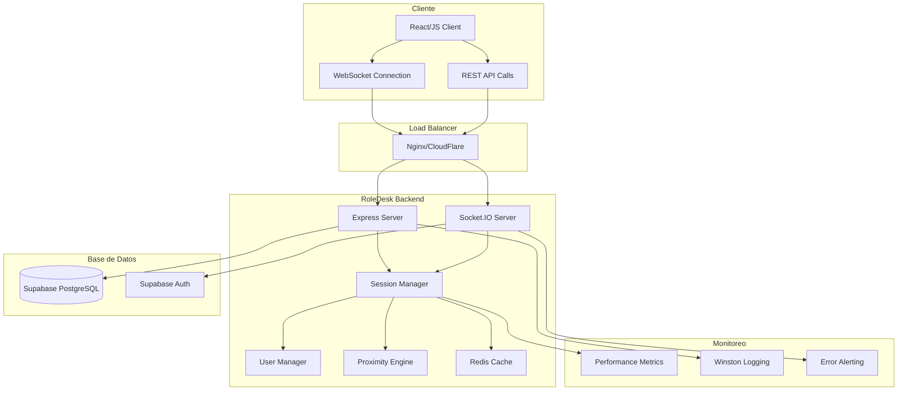

# RoleDesk Backend - Sistema de Espacios Virtuales Colaborativos

<div align="center">


**Servidor backend de alta performance construido con Node.js, TypeScript y Socket.IO**

[](https://nodejs.org/)
[](https://www.typescriptlang.org/)
[](https://socket.io/)
[](https://supabase.com/)
[](https://www.gnu.org/licenses/gpl-3.0)

[🚀 Instalación](#-instalación-rápida) • [📚 Documentación](#-documentación) • [🛠️ API](#️-api-reference) • [🤝 Contribuir](#-contribuir)

</div>

---

## 🏗️ Arquitectura del Sistema

RoleDesk Backend proporciona infraestructura robusta para espacios virtuales colaborativos con comunicación en tiempo real, gestión de sesiones distribuidas y algoritmos optimizados de proximidad para video chat automático.



### 🎯 Características Técnicas Principales

| Categoría | Características |
|-----------|----------------|
| **🚀 Performance** | • Soporte para 1000+ usuarios concurrentes<br>• Latencia <50ms en eventos WebSocket<br>• Throughput de 10,000 eventos/segundo<br>• Memory pooling y garbage collection optimizada |
| **🔒 Seguridad** | • Autenticación JWT con Supabase Auth<br>• Row Level Security (RLS) en base de datos<br>• Rate limiting avanzado por endpoint y evento<br>• Validación exhaustiva con Zod schemas |
| **📡 Tiempo Real** | • WebSocket bidireccional con Socket.IO<br>• Event batching para optimización<br>• Proximity engine con spatial partitioning<br>• Sincronización de estado distribuido |
| **📊 Escalabilidad** | • Architecture event-driven<br>• Redis clustering para múltiples instancias<br>• Connection pooling optimizado<br>• Horizontal scaling ready |

---

## 🚀 Instalación Rápida

### Prerrequisitos

- **Node.js** 18.0.0 o superior
- **npm** 8.0.0 o superior  
- **Proyecto Supabase** configurado con las [tablas requeridas](docs/DATABASE.md)

### 1. Clonación e Instalación

```bash
# Clonar repositorio
git clone <repository-url>
cd gather-clone/RoleDesk_B

# Instalar dependencias
npm install

# Verificar instalación
npm run type-check
```

### 2. Configuración de Variables de Entorno

```bash
# Copiar template de configuración
cp .env.example .env

# Editar variables requeridas
nano .env
```

```env
# === CONFIGURACIÓN DEL SERVIDOR ===
PORT=3001
NODE_ENV=development

# === SUPABASE CONFIGURATION ===
SUPABASE_URL=https://tu-proyecto.supabase.co
SERVICE_ROLE=tu_supabase_service_role_key

# === CORS CONFIGURATION ===
FRONTEND_URL=http://localhost:3000
```

### 3. Configuración de Base de Datos

Ejecutar el setup de [Database Schema](docs/DATABASE.md) en tu proyecto Supabase.

### 4. Ejecutar el Servidor

```bash
# Modo desarrollo (recomendado)
npm run dev

# Verificar que funciona
curl http://localhost:3001/health
```

**✅ ¡Listo!** El servidor estará disponible en `http://localhost:3001`

---

## 📚 Documentación

### 📖 Documentación Técnica Completa

| Documento | Descripción | Estado |
|-----------|-------------|--------|
| **[🗄️ Database Schema](docs/DATABASE.md)** | Configuración completa de Supabase, tablas, políticas RLS, triggers y optimizaciones | ✅ Completo |
| **[🔌 Socket Events](docs/SOCKET_EVENTS.md)** | Documentación exhaustiva de eventos WebSocket, validaciones y flujos | ✅ Completo |
| **[🛡️ Security Guide](docs/SECURITY.md)** | Mejores prácticas de seguridad, autenticación, autorización y incident response | ✅ Completo |
| **[⚡ Performance Guide](docs/PERFORMANCE.md)** | Optimizaciones de memoria, CPU, base de datos y técnicas de escalabilidad | ✅ Completo |
| **[🐛 Troubleshooting](docs/TROUBLESHOOTING.md)** | Solución de problemas comunes, debugging y herramientas de diagnóstico | ✅ Completo |
| **[📡 API Reference](docs/API.md)** | Documentación completa de REST API y WebSocket API con ejemplos | ✅ Completo |

### 🏗️ Arquitectura de Módulos

```
src/
├── 🚀 index.ts                 # Bootstrap del servidor y configuración inicial
├── 🔧 supabase.ts             # Cliente Supabase y configuración de conexión  
├── 📊 session.ts              # SessionManager - Gestión centralizada de sesiones
├── 👥 Users.ts                # UserManager - Cache de usuarios en memoria
├── 🛠️ utils.ts                # Utilidades compartidas y helpers
├── 🌐 routes/                 # Capa de API REST
│   ├── routes.ts              # Definición de endpoints y middleware
│   └── route-types.ts         # Tipos TypeScript para requests/responses
└── ⚡ sockets/                # Capa de comunicación en tiempo real
    ├── sockets.ts             # Event handlers y lógica de negocio
    ├── socket-types.ts        # Schemas Zod y tipos de eventos
    └── helpers.ts             # Funciones auxiliares para sockets
```

---

## ⚙️ Stack Tecnológico

### Core Dependencies

| Tecnología | Versión | Propósito | Documentación |
|------------|---------|-----------|---------------|
| **Node.js** | 18+ | Runtime JavaScript | [nodejs.org](https://nodejs.org/) |
| **TypeScript** | 5.8+ | Tipado estático y desarrollo escalable | [typescriptlang.org](https://www.typescriptlang.org/) |
| **Express.js** | 4.19+ | Framework web HTTP | [expressjs.com](https://expressjs.com/) |
| **Socket.IO** | 4.7+ | Comunicación WebSocket bidireccional | [socket.io](https://socket.io/) |
| **Supabase** | 2.43+ | Backend-as-a-Service (PostgreSQL) | [supabase.com](https://supabase.com/) |
| **Zod** | 3.23+ | Validación de schemas y runtime types | [zod.dev](https://zod.dev/) |

### Development Tools

```json
{
  "devDependencies": {
    "@types/cors": "^2.8.17",
    "@types/express": "^4.17.21", 
    "@types/node": "^20.12.7",
    "@types/uuid": "^10.0.0",
    "ts-node": "^10.9.2",
    "typescript": "^5.8.3"
  }
}
```

---

## 🛠️ API Reference

### 🌐 REST API Endpoints

```http
GET  /health                    # Estado del servidor
POST /api/realms               # Crear nuevo espacio virtual
GET  /api/realms/:id           # Obtener datos del espacio
PUT  /api/realms/:id           # Actualizar espacio
GET  /api/profiles/:uid        # Obtener perfil de usuario
PUT  /api/profiles/me          # Actualizar perfil propio
```

### ⚡ WebSocket Events

#### 📤 Cliente → Servidor
- `joinRealm` - Unirse a un espacio virtual
- `movePlayer` - Actualizar posición del jugador  
- `teleport` - Teletransportar a nueva ubicación
- `changedSkin` - Cambiar apariencia del avatar
- `sendMessage` - Enviar mensaje de chat

#### 📥 Servidor → Cliente  
- `realmJoined` - Confirmación de unión exitosa
- `playerMoved` - Movimiento de otro jugador
- `proximityUpdate` - Cambios en proximidad para video chat
- `messageReceived` - Nuevo mensaje de chat
- `sessionTerminated` - Sesión terminada por el servidor

**📖 [Ver documentación completa de API](docs/API.md)**

---

## 🔧 Scripts de Desarrollo

```bash
# 🚀 Desarrollo
npm run dev              # Servidor con hot-reload (ts-node + nodemon)
npm run type-check       # Verificación de tipos TypeScript

# 🏗️ Construcción y Producción  
npm run build            # Compilar TypeScript → JavaScript
npm start                # Ejecutar servidor compilado

# 🧪 Testing y Calidad
npm test                 # Ejecutar test suite
npm run test:watch       # Tests en modo watch
npm run lint             # Linting con ESLint

# 📦 Deployment
npm run heroku-postbuild # Build automático para Heroku
```

---

## 🚀 Despliegue en Producción

### 🐳 Docker

```dockerfile
FROM node:18-alpine
WORKDIR /app

# Instalar dependencias
COPY package*.json ./
RUN npm ci --only=production

# Copiar aplicación compilada
COPY dist ./dist

# Configurar usuario no-root
RUN addgroup -g 1001 -S nodejs && \
    adduser -S backend -u 1001
USER backend

EXPOSE 3001
CMD ["npm", "start"]
```

### ☁️ Railway/Heroku

```bash
# Configurar variables de entorno en el dashboard
SUPABASE_URL=https://tu-proyecto.supabase.co
SERVICE_ROLE=tu_production_service_role_key
FRONTEND_URL=https://tu-dominio.com
NODE_ENV=production
```

### 🔧 PM2 (VPS/Servidor Dedicado)

```bash
# Instalar PM2 globalmente
npm install -g pm2

# Configurar ecosystem
cp ecosystem.config.js.example ecosystem.config.js

# Desplegar
pm2 start ecosystem.config.js --env production
pm2 save
pm2 startup
```

**📖 [Ver guía completa de deployment](docs/PERFORMANCE.md#production-optimizations)**

---

## 📊 Monitoreo y Observabilidad

### 📈 Métricas en Tiempo Real

```bash
# Endpoint de métricas de performance
curl http://localhost:3001/debug/metrics | jq

# Monitoreo con PM2
pm2 monit

# Logs en tiempo real
pm2 logs --lines 50
```

### 🔍 Health Checks

```bash
# Health check básico
curl http://localhost:3001/health

# Estado de sesiones activas  
curl http://localhost:3001/debug/sessions

# Métricas de base de datos
curl http://localhost:3001/debug/db-stats
```

### 📊 Métricas de Performance Objetivo

| Métrica | Desarrollo | Producción |
|---------|------------|------------|
| **Latencia WebSocket** | <100ms | <50ms |
| **Throughput Eventos** | 5,000/s | 10,000/s |
| **Usuarios Concurrentes** | 100+ | 1,000+ |
| **Uso de Memoria** | <1GB | <512MB |
| **Uptime** | 99%+ | 99.9%+ |

---

## 🐛 Debugging y Troubleshooting

### 🔍 Comandos de Diagnóstico

```bash
# Verificar conectividad de base de datos
npm run test:db

# Verificar configuración
npm run validate-config

# Análisis de memoria
node --inspect dist/index.js

# Profiling de performance
clinic doctor -- node dist/index.js
```

### 📋 Problemas Comunes

| Problema | Solución Rápida | Documentación |
|----------|-----------------|---------------|
| "Invalid access token" | Verificar variables SUPABASE_URL y SERVICE_ROLE | [🛡️ Security Guide](docs/SECURITY.md) |
| "Connection refused" | Verificar puerto y firewall, revisar CORS | [🐛 Troubleshooting](docs/TROUBLESHOOTING.md) |
| "High memory usage" | Revisar session cleanup y memory leaks | [⚡ Performance Guide](docs/PERFORMANCE.md) |
| "Players not syncing" | Verificar room membership y state reconciliation | [🔌 Socket Events](docs/SOCKET_EVENTS.md) |

**📖 [Ver guía completa de troubleshooting](docs/TROUBLESHOOTING.md)**

---

## 🧪 Testing

### 🔬 Test Suite

```bash
# Ejecutar todos los tests
npm test

# Tests con coverage
npm run test:coverage

# Tests de integración 
npm run test:integration

# Load testing con Artillery
npm run load-test
```

### 📝 Escribir Tests

```typescript
// Ejemplo de test de API
describe('Realms API', () => {
  test('should create realm successfully', async () => {
    const response = await request(app)
      .post('/api/realms')
      .set('Authorization', `Bearer ${authToken}`)
      .send({
        map_data: {
          name: 'Test Realm',
          dimensions: { width: 800, height: 600 }
        }
      })
      .expect(201)
    
    expect(response.body).toHaveProperty('id')
    expect(response.body.map_data.name).toBe('Test Realm')
  })
})
```

---

## 🤝 Contribuir

### 🛠️ Configuración del Entorno de Desarrollo

```bash
# Fork y clonar el repositorio
git clone https://github.com/tu-usuario/roledesk-backend.git
cd roledesk-backend

# Instalar dependencias
npm install

# Configurar hooks de Git
npm run prepare

# Ejecutar verificaciones
npm run lint && npm run type-check && npm test
```

### 📋 Proceso de Contribución

1. **🍴 Fork** el proyecto
2. **🌿 Branch** para tu feature (`git checkout -b feature/nueva-funcionalidad`)
3. **✨ Commit** tus cambios (`git commit -m 'feat: agregar nueva funcionalidad'`)
4. **🚀 Push** a la branch (`git push origin feature/nueva-funcionalidad`)
5. **🔄 Pull Request** con descripción detallada

### 📏 Estándares de Código

- ✅ **TypeScript Strict Mode** obligatorio
- ✅ **ESLint + Prettier** para formateo
- ✅ **Conventional Commits** para mensajes
- ✅ **Test Coverage** >80% para nuevas features
- ✅ **Zod Validation** para todos los inputs
- ✅ **Error Handling** exhaustivo con logging

### 🎯 Áreas que Necesitan Contribución

- [ ] 🔐 Sistema de moderación avanzado
- [ ] 📊 Dashboard de analytics en tiempo real  
- [ ] 🎮 Plugin system para extensibilidad
- [ ] 🌍 Internacionalización (i18n)
- [ ] 📱 SDK para desarrollo de clientes
- [ ] 🧪 Más test coverage y casos edge

---

## 📊 Estado del Proyecto

<div align="center">

### 🟢 **Estado: Activo**
*Desarrollo activo con nuevas características implementándose regularmente*


</div>

### 🗺️ Roadmap 2025

| Q2 2025 | Q3 2025 | Q4 2025 | 2026 |
|---------|---------|---------|------|
| • Sistema de Moderación<br>• Rate Limiting Avanzado<br>• Métricas Extensas | • Redis Clustering<br>• Auto-scaling<br>• Performance Optimizations | • GraphQL API<br>• Plugin System<br>• Advanced Analytics | • AI-powered Features<br>• Multi-region Support<br>• Enterprise Features |

---

## 📄 Licencia

Este proyecto está licenciado bajo **GNU General Public License v3.0**.

### 📜 Resumen de la Licencia

✅ **Permitido**:
- ✅ Uso comercial y personal
- ✅ Modificación del código fuente
- ✅ Distribución del software
- ✅ Uso de patentes incluidas

❌ **Limitaciones**:
- ❌ Sin garantía de funcionamiento
- ❌ Sin responsabilidad por daños
- ❌ Debe mantener la misma licencia GPL v3

📝 **Condiciones**:
- 📝 Incluir licencia y copyright en distribuciones
- 📝 Documentar cambios realizados al código
- 📝 Divulgar código fuente completo si se distribuye
- 📝 Usar la misma licencia GPL v3 en trabajos derivados

**[📖 Ver licencia completa](LICENSE)**

---

## 👥 Equipo y Contacto

### 🏆 Desarrollador Principal

<div align="center">

**Diego Chicuazuque**

[](https://github.com/diego-chicuazuque)
[](https://linkedin.com/in/diego-chicuazuque)
[](mailto:diego.chicuazuque@email.com)

</div>

### 🤝 Contribuidores

Ver [CONTRIBUTORS.md](./CONTRIBUTORS.md) para la lista completa de contribuidores que han hecho posible este proyecto.

### 📞 Soporte y Comunidad

- **🐛 Issues**: [GitHub Issues](https://github.com/roledesk/backend/issues)
- **💬 Discusiones**: [GitHub Discussions](https://github.com/roledesk/backend/discussions)  
- **📧 Email**: [support@roledesk.app](mailto:support@roledesk.app)
- **💬 Discord**: [discord.gg/roledesk](https://discord.gg/roledesk)
- **📱 Twitter**: [@RoleDeskApp](https://twitter.com/RoleDeskApp)

---

## 🙏 Agradecimientos

<div align="center">

**Agradecimientos especiales a:**

- 🚀 **[Socket.IO](https://socket.io/)** por el excelente framework de WebSockets
- 🗄️ **[Supabase](https://supabase.com/)** por la infraestructura de backend robusta
- 🏗️ **Comunidad de Node.js y TypeScript** por las herramientas increíbles
- 🌟 **Todos los contribuidores** que han mejorado este proyecto

</div>

---

<div align="center">

### 🚀 **¿Listo para construir tu propio metaverso?**

**[📖 Leer Documentación](docs/)** • **[🛠️ Ver API Reference](docs/API.md)** • **[🤝 Contribuir](#-contribuir)**

---

**Construido con ❤️ por el equipo de RoleDesk**

*Última actualización: 28 de junio de 2025*


</div>
