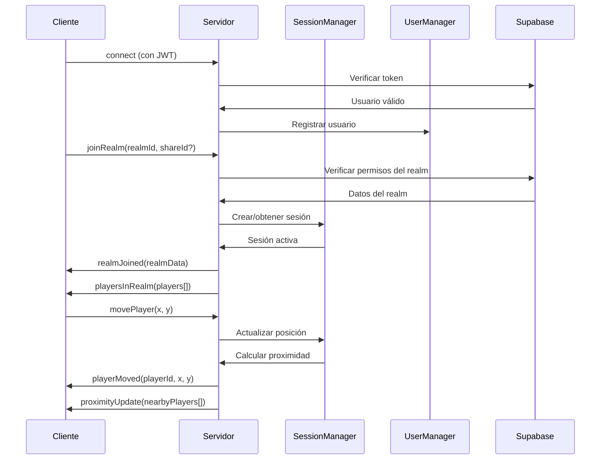

# Socket Events Documentation

## Arquitectura de Eventos en Tiempo Real

### Flujo de Comunicación



## Eventos Cliente → Servidor

### 1. joinRealm
Permite a un usuario unirse a un espacio virtual específico.

**Schema de Validación:**
```typescript
const JoinRealm = z.object({
    realmId: z.string().uuid("ID del realm debe ser un UUID válido"),
    shareId: z.string().uuid().optional().or(z.literal(''))
})
```

**Ejemplo de uso:**
```typescript
socket.emit('joinRealm', {
    realmId: "550e8400-e29b-41d4-a716-446655440000",
    shareId: "660e8400-e29b-41d4-a716-446655440001" // opcional
})
```

**Validaciones realizadas:**
- Token JWT válido
- Realm existe en la base de datos
- Usuario tiene permisos (owner o realm público)
- ShareId válido si el realm lo requiere

**Respuestas posibles:**
- `realmJoined`: Éxito al unirse
- `error`: Fallo en validación o permisos

---

### 2. movePlayer
Actualiza la posición del jugador en el realm.

**Schema de Validación:**
```typescript
const MovePlayer = z.object({
    x: z.number()
      .min(-10000, "Coordenada X mínima: -10000")
      .max(10000, "Coordenada X máxima: 10000"),
    y: z.number()
      .min(-10000, "Coordenada Y mínima: -10000") 
      .max(10000, "Coordenada Y máxima: 10000")
})
```

**Ejemplo de uso:**
```typescript
socket.emit('movePlayer', {
    x: 245.6,
    y: 180.2
})
```

**Lógica del servidor:**
1. Validar coordenadas dentro de límites
2. Actualizar posición en memoria
3. Calcular proximidad con otros jugadores
4. Broadcast posición a otros jugadores en el realm
5. Enviar updates de proximidad si hay cambios

---

### 3. teleport
Teletransporta al jugador a una nueva posición y/o sala.

**Schema de Validación:**
```typescript
const Teleport = z.object({
    x: z.number(),
    y: z.number(),
    roomIndex: z.number().min(0, "Índice de sala debe ser >= 0")
})
```

**Ejemplo de uso:**
```typescript
socket.emit('teleport', {
    x: 400,
    y: 300,
    roomIndex: 1
})
```

**Comportamiento:**
- Movimiento instantáneo sin animación
- Cambio de sala si roomIndex es diferente
- Actualización inmediata de proximidad
- Notificación a todos los jugadores del realm

---

### 4. changedSkin
Cambia la apariencia/avatar del jugador.

**Schema de Validación:**
```typescript
const ChangedSkin = z.string()
  .min(1, "Skin no puede estar vacío")
  .max(50, "Skin máximo 50 caracteres")
```

**Ejemplo de uso:**
```typescript
socket.emit('changedSkin', "avatar_002")
```

**Comportamiento:**
- Actualiza el skin en la base de datos (tabla profiles)
- Notifica el cambio a todos los jugadores del realm
- Persiste el cambio para futuras sesiones

---

### 5. sendMessage
Envía un mensaje de chat al realm.

**Schema de Validación:**
```typescript
const NewMessage = z.string()
  .min(1, "Mensaje no puede estar vacío")
  .max(500, "Mensaje máximo 500 caracteres")
  .refine(
    (msg) => msg.trim().length > 0,
    "Mensaje no puede ser solo espacios"
  )
```

**Ejemplo de uso:**
```typescript
socket.emit('sendMessage', "¡Hola a todos!")
```

**Funcionalidades:**
- Rate limiting (máximo 10 mensajes por minuto)
- Filtrado de contenido básico
- Broadcast a todos los jugadores del realm
- Historial temporal en memoria (últimos 50 mensajes)

---

### 6. disconnect
Evento automático cuando el cliente se desconecta.

**Comportamiento automático:**
- Remover jugador de la sesión activa
- Notificar a otros jugadores sobre la desconexión
- Limpiar estado en memoria
- Cerrar sesión si no quedan jugadores

## Eventos Servidor → Cliente

### 1. realmJoined
Confirmación exitosa de unión al realm.

**Payload:**
```typescript
interface RealmJoinedPayload {
    realm: {
        id: string
        owner_id: string
        map_data: object
        share_id?: string
        only_owner: boolean
    }
    player: {
        id: string
        x: number
        y: number
        skin: string
        displayName?: string
    }
    roomIndex: number
}
```

**Ejemplo:**
```typescript
socket.on('realmJoined', (data) => {
    console.log('Unido al realm:', data.realm.id)
    console.log('Mi posición:', data.player.x, data.player.y)
    console.log('Sala actual:', data.roomIndex)
})
```

---

### 2. playersInRealm
Lista de todos los jugadores actualmente en el realm.

**Payload:**
```typescript
interface PlayersInRealmPayload {
    players: Array<{
        id: string
        x: number
        y: number
        skin: string
        displayName?: string
        roomIndex: number
    }>
}
```

**Enviado cuando:**
- Un jugador se une al realm
- Un jugador cambia de sala
- Solicitud explícita de actualización

---

### 3. playerJoined
Notificación cuando un nuevo jugador se une.

**Payload:**
```typescript
interface PlayerJoinedPayload {
    player: {
        id: string
        x: number
        y: number
        skin: string
        displayName?: string
        roomIndex: number
    }
}
```

---

### 4. playerLeft
Notificación cuando un jugador abandona el realm.

**Payload:**
```typescript
interface PlayerLeftPayload {
    playerId: string
    reason?: 'disconnect' | 'kicked' | 'realm_changed'
}
```

---

### 5. playerMoved
Actualización de posición de otro jugador.

**Payload:**
```typescript
interface PlayerMovedPayload {
    playerId: string
    x: number
    y: number
    timestamp: number
}
```

**Optimizaciones:**
- Throttling a 60fps máximo
- Solo enviar si el movimiento es significativo (>1 pixel)
- Interpolación en el cliente para suavizar movimiento

---

### 6. playerTeleported
Notificación de teletransporte de otro jugador.

**Payload:**
```typescript
interface PlayerTeleportedPayload {
    playerId: string
    x: number
    y: number
    roomIndex: number
}
```

---

### 7. proximityUpdate
Actualización de jugadores cercanos para video chat.

**Payload:**
```typescript
interface ProximityUpdatePayload {
    nearbyPlayers: string[] // Array de IDs de jugadores
    disconnectedPlayers: string[] // Jugadores que ya no están cerca
}
```

**Algoritmo de proximidad:**
```typescript
const PROXIMITY_THRESHOLD = 150 // pixels

function calculateProximity(player1: Player, player2: Player): boolean {
    const distance = Math.sqrt(
        Math.pow(player1.x - player2.x, 2) + 
        Math.pow(player1.y - player2.y, 2)
    )
    return distance <= PROXIMITY_THRESHOLD
}
```

---

### 8. playerSkinChanged
Notificación de cambio de skin de otro jugador.

**Payload:**
```typescript
interface PlayerSkinChangedPayload {
    playerId: string
    newSkin: string
}
```

---

### 9. messageReceived
Nuevo mensaje de chat en el realm.

**Payload:**
```typescript
interface MessageReceivedPayload {
    id: string
    senderId: string
    senderName: string
    message: string
    timestamp: number
    roomIndex?: number // Si el mensaje es específico de una sala
}
```

---

### 10. sessionTerminated
El servidor ha terminado la sesión del realm.

**Payload:**
```typescript
interface SessionTerminatedPayload {
    reason: string
    code: 'REALM_UPDATED' | 'REALM_DELETED' | 'OWNER_KICKED' | 'SERVER_RESTART'
}
```

**Razones comunes:**
- Realm modificado por el propietario
- Realm eliminado
- Usuario expulsado por moderación
- Mantenimiento del servidor

---

### 11. error
Error en el procesamiento de eventos.

**Payload:**
```typescript
interface ErrorPayload {
    event: string // Evento que causó el error
    message: string
    code: 'VALIDATION_ERROR' | 'AUTH_ERROR' | 'PERMISSION_ERROR' | 'SERVER_ERROR'
    details?: object
}
```

## Manejo de Errores y Reconexión

### Estrategia de Reconexión del Cliente

```typescript
const socket = io(SERVER_URL, {
    autoConnect: true,
    reconnection: true,
    reconnectionDelay: 1000,
    reconnectionDelayMax: 5000,
    maxReconnectionAttempts: 5
})

socket.on('disconnect', (reason) => {
    console.log('Desconectado:', reason)
    
    if (reason === 'io server disconnect') {
        // El servidor forzó la desconexión
        // No intentar reconectar automáticamente
        showErrorMessage('Conexión terminada por el servidor')
    }
})

socket.on('connect', () => {
    console.log('Reconectado!')
    // Reenviar joinRealm para restaurar estado
    socket.emit('joinRealm', lastRealmData)
})
```

### Validación de Estado en el Servidor

```typescript
// Middleware para validar estado antes de procesar eventos
function validatePlayerState(socket: Socket, callback: Function) {
    const user = userManager.getUserBySocketId(socket.id)
    if (!user) {
        socket.emit('error', {
            event: 'validation',
            message: 'Usuario no encontrado',
            code: 'AUTH_ERROR'
        })
        return false
    }
    
    const session = sessionManager.getSessionByPlayerId(user.id)
    if (!session) {
        socket.emit('error', {
            event: 'validation', 
            message: 'No hay sesión activa',
            code: 'SESSION_ERROR'
        })
        return false
    }
    
    return callback(user, session)
}
```

## Performance y Optimizaciones

### Throttling de Eventos

```typescript
// Límite de eventos por segundo
const eventLimits = {
    movePlayer: 60,    // 60 FPS máximo
    sendMessage: 2,    // 2 mensajes por segundo
    teleport: 5,       // 5 teletransportes por segundo
    changedSkin: 1     // 1 cambio de skin por segundo
}

// Implementación de rate limiting
const rateLimiter = new Map()

function isRateLimited(socketId: string, event: string): boolean {
    const key = `${socketId}:${event}`
    const now = Date.now()
    const limit = eventLimits[event]
    
    if (!rateLimiter.has(key)) {
        rateLimiter.set(key, { count: 1, resetTime: now + 1000 })
        return false
    }
    
    const data = rateLimiter.get(key)
    
    if (now > data.resetTime) {
        data.count = 1
        data.resetTime = now + 1000
        return false
    }
    
    if (data.count >= limit) {
        return true
    }
    
    data.count++
    return false
}
```

### Optimización de Proximidad

```typescript
// Spatial partitioning para optimizar cálculo de proximidad
class SpatialGrid {
    private grid: Map<string, Set<string>> = new Map()
    private cellSize = 200
    
    updatePlayerPosition(playerId: string, x: number, y: number) {
        // Remover de celdas anteriores
        this.removePlayer(playerId)
        
        // Agregar a nueva celda
        const cellKey = this.getCellKey(x, y)
        if (!this.grid.has(cellKey)) {
            this.grid.set(cellKey, new Set())
        }
        this.grid.get(cellKey)!.add(playerId)
    }
    
    getNearbyPlayers(playerId: string, x: number, y: number): string[] {
        const nearbyPlayers: string[] = []
        const cellKey = this.getCellKey(x, y)
        
        // Buscar en celda actual y adyacentes
        for (let dx = -1; dx <= 1; dx++) {
            for (let dy = -1; dy <= 1; dy++) {
                const adjacentKey = this.getCellKey(
                    x + dx * this.cellSize,
                    y + dy * this.cellSize
                )
                
                const playersInCell = this.grid.get(adjacentKey)
                if (playersInCell) {
                    nearbyPlayers.push(...playersInCell)
                }
            }
        }
        
        return nearbyPlayers.filter(id => id !== playerId)
    }
    
    private getCellKey(x: number, y: number): string {
        const cellX = Math.floor(x / this.cellSize)
        const cellY = Math.floor(y / this.cellSize)
        return `${cellX},${cellY}`
    }
}
```

### Monitoreo de Events

```typescript
// Métricas de eventos para monitoring
class EventMetrics {
    private eventCounts = new Map<string, number>()
    private eventTimes = new Map<string, number[]>()
    
    recordEvent(eventName: string, processingTime: number) {
        // Incrementar contador
        this.eventCounts.set(
            eventName,
            (this.eventCounts.get(eventName) || 0) + 1
        )
        
        // Registrar tiempo de procesamiento
        if (!this.eventTimes.has(eventName)) {
            this.eventTimes.set(eventName, [])
        }
        
        const times = this.eventTimes.get(eventName)!
        times.push(processingTime)
        
        // Mantener solo los últimos 100 tiempos
        if (times.length > 100) {
            times.shift()
        }
    }
    
    getMetrics() {
        const metrics = {}
        
        for (const [event, count] of this.eventCounts) {
            const times = this.eventTimes.get(event) || []
            const avgTime = times.reduce((a, b) => a + b, 0) / times.length
            
            metrics[event] = {
                count,
                avgProcessingTime: avgTime,
                lastMinuteRate: this.getLastMinuteRate(event)
            }
        }
        
        return metrics
    }
}
```

## Testing de Socket Events

### Tests de Integración

```typescript
describe('Socket Events Integration', () => {
    let clientSocket: Socket
    let serverSocket: Socket
    
    beforeEach((done) => {
        // Setup test server y cliente
        serverSocket = server.listen(() => {
            const port = serverSocket.address().port
            clientSocket = Client(`http://localhost:${port}`)
            clientSocket.on('connect', done)
        })
    })
    
    afterEach(() => {
        serverSocket.close()
        clientSocket.close()
    })
    
    test('joinRealm success flow', (done) => {
        clientSocket.emit('joinRealm', {
            realmId: 'test-realm-id',
            shareId: 'test-share-id'
        })
        
        clientSocket.on('realmJoined', (data) => {
            expect(data.realm.id).toBe('test-realm-id')
            expect(data.player).toBeDefined()
            done()
        })
    })
    
    test('movePlayer proximity calculation', (done) => {
        // Test proximity updates when players move close
        // ... implementación del test
    })
})
```

## Documentación de Debugging

### Logs de Desarrollo

```typescript
// Logger configurado para diferentes niveles
const logger = {
    socket: (message: string, data?: any) => {
        console.log(`[SOCKET] ${message}`, data || '')
    },
    proximity: (message: string, data?: any) => {
        console.log(`[PROXIMITY] ${message}`, data || '')
    },
    session: (message: string, data?: any) => {
        console.log(`[SESSION] ${message}`, data || '')
    }
}

// Usar en event handlers
socket.on('movePlayer', (data) => {
    logger.socket(`Player ${socket.userId} moved to`, data)
    // ... resto de la lógica
})
```

### Herramientas de Debug

```bash
# Monitorear eventos en tiempo real
DEBUG=socket.io* npm run dev

# Ver métricas de performance
curl http://localhost:3001/debug/metrics

# Estado de sesiones activas
curl http://localhost:3001/debug/sessions
```
